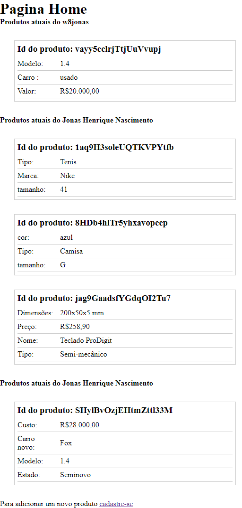
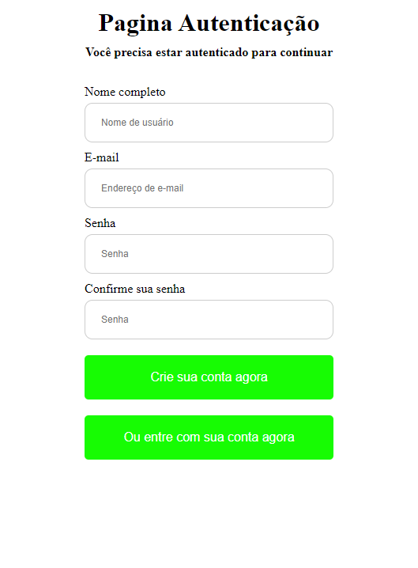
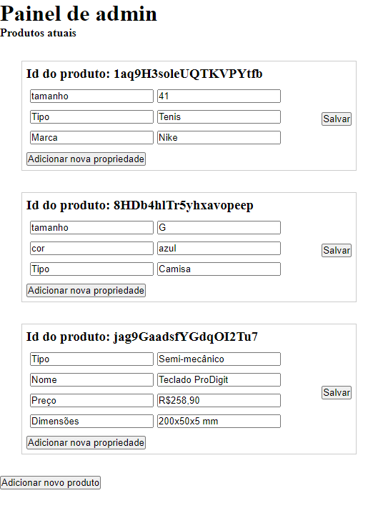

# ReactJs CRUD With Firebase

## Descrição
Este projeto foi desenvolvido utilizando ReactJs + Firebase para realizar um CRUD simples e dinâmico de produtos. A proposta do projeto é oferecer um sistema de Cadastro/login para que, quando o usuário esteja logado, possa adicionar vários produtos ao banco de dados de forma totalmente dinâmica, de modo que os usuário públicos, isto é, os usuário não autenticados, possam ver a listagem desses produtos e seus respectivos anunciadores. É válido lembrar que não foi dado muita atenção a parte visual do sistema.

Este projeto está em produção no Heroku, você pode acessa-lô [clicando aqui.](https://frontend-crud-firebase.herokuapp.com/)

## Fotos do projeto:

  |   |    | 
:---------------:|:----------------:|:-----------------:|

## Tecnologias
Esse projeto foi desenvolvido utilizando como principal linguagem o **Javascript**, unido ao framework **ReactJs**, além de **Firebase** no backend.

  
Backend

 - Firebase auth
 - Firebase Google SignIn auth
 - Firebase Firestore

  
Frontend

  
 - Javascript
 - Firebase auth
 - React Router Dom
 - HTML
 - CSS

